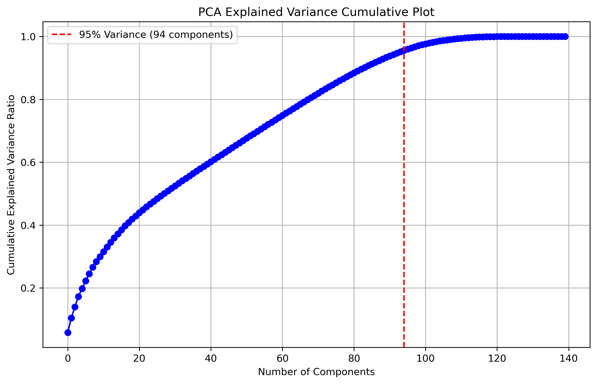
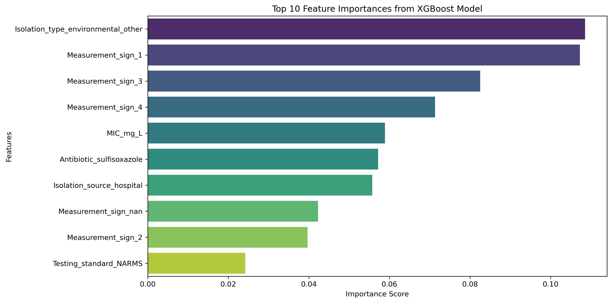
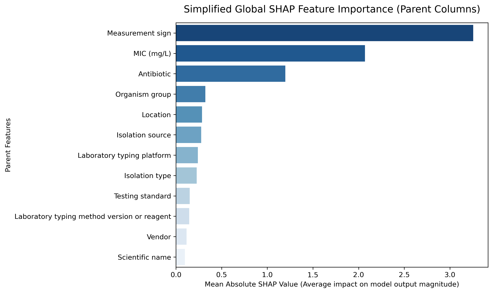
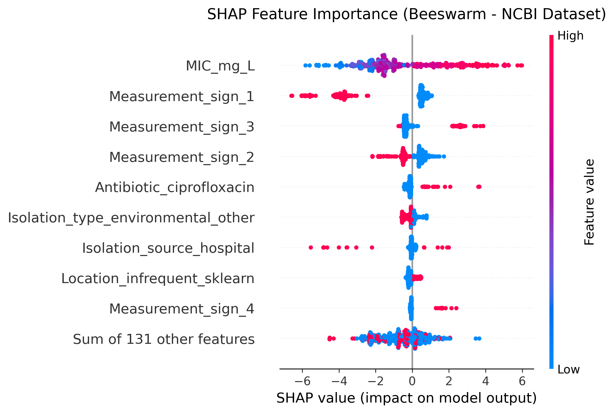

# Anti-Microbial Resistance (AMR) Detection & Analysis Pipeline

This repository implements a production-grade Machine Learning pipeline to predict antimicrobial resistance phenotypes (Susceptible vs. Resistant) from bacterial, clinical, and experimental metadata. 

Using a dataset of **401,831 records** from the **NCBI Pathogen Detection database**, we train regularized linear models (L1 Lasso / L2 Ridge Logistic Regression) and gradient boosted trees (XGBoost Classifier) to predict resistance outcomes, analyze feature space dimensionality via PCA, and explain predictions using SHAP.

---

## 📊 Model Performance Summary (NCBI Test Set)

Our models achieve exceptionally high accuracy and recall because they successfully learn the clinical breakpoint thresholds (rules linking bacterial species, drug names, and MIC values):

| Model | Accuracy | Precision (Resistant) | Recall (Resistant) | F1-Score (Resistant) |
| :--- | :--- | :--- | :--- | :--- |
| **L1 Logistic Regression (Lasso)** | 95.66% | 91.98% | 89.71% | 90.83% |
| **L2 Logistic Regression (Ridge)** | 95.66% | 91.94% | 89.73% | 90.82% |
| **XGBoost Classifier (Balanced)** | **98.39%** | **94.89%** | **98.59%** | **96.70%** |

### Confusion Matrix (XGBoost)
```
[[60110  1022]   <-- Susceptible correctly classified, false Resistant
 [  271 18964]]  <-- False Susceptible, Resistant correctly classified (98.6% Recall)
```

---

## 🧬 Dataset Features (Column Breakdown)

The pipeline utilizes **13 core features** representing a mix of taxonomy, collection epidemiology, and experimental parameters:

### Biological & Taxonomic Features
* **`Organism group`**: The high-level taxonomic grouping of the bacterial isolate (e.g., *Salmonella enterica*, *Escherichia coli*, *Klebsiella pneumoniae*).
* **`Scientific name`**: The detailed taxonomic name, including serovar, strain, or subspecies designation.
* **`Isolation source`**: The physical matrix from which the sample was cultured (e.g., `chicken breast`, `urine`, `pork chop`, `feces`, `blood`).
* **`Isolation type`**: Broad epidemiological category indicating whether the sample is clinical (human patient) or environmental/other.

### Geographical & Database Features
* **`Location`**: The country of origin where the sample was collected (e.g., `USA`, `United Kingdom`, `Germany`).

### Experimental & Phenotypic Features (Core Predictors)
* **`Antibiotic`**: The specific antimicrobial agent tested against the isolate (e.g., `amikacin`, `ciprofloxacin`, `ampicillin`).
* **`MIC (mg/L)`**: Minimum Inhibitory Concentration. This represents the lowest concentration of an antibiotic that prevents visible growth of the bacterium. Since MIC values increase exponentially (0.25, 0.5, 1, 2, 4, 8...), the pipeline applies a `log2` scale.
* **`Measurement sign`**: The relational operator of the MIC test (e.g., `<=`, `==`, `>`), indicating if the true boundary is exact or bounded.
* **`Laboratory typing platform`**: The automated platform or instrument used to determine MIC values (e.g., `Phoenix`, `MicroScan`, `Vitek 2`).
* **`Vendor`**: The card or panel manufacturer.
* **`Laboratory typing method version or reagent`**: The specific card/panel version or reagent lot used.
* **`Testing standard`**: The clinical guidelines used to interpret MIC values (e.g., `CLSI` - Clinical and Laboratory Standards Institute, `EUCAST` - European Committee on Antimicrobial Susceptibility Testing).
* **`Resistance phenotype` (Target)**: The binary target classification representing whether the isolate is clinically **susceptible** or **resistant** to the drug.

---

## 📈 Principal Component Analysis (PCA)

We project the 140 standardized features onto orthogonal components to analyze the dimensionality of the feature space. We find that **94 components** are required to capture 95% of the cumulative variance.

### PCA Explained Variance Curve


---

## 🤖 Feature Importance Rankings

### XGBoost Feature Importance
XGBoost feature scores show that `MIC (mg/L)` and its associated testing parameters are the leading indicators of resistance:



### Aggregated SHAP Parent Feature Importance
To make the global rules easily interpretable, we aggregated the SHAP values of the 140 one-hot encoded features back into their original **12 parent columns**:



### SHAP Global Beeswarm Summary (One-Hot Encoded Features)
For a detailed look, the beeswarm plot below shows the individual impact of the top one-hot encoded categories:



---

